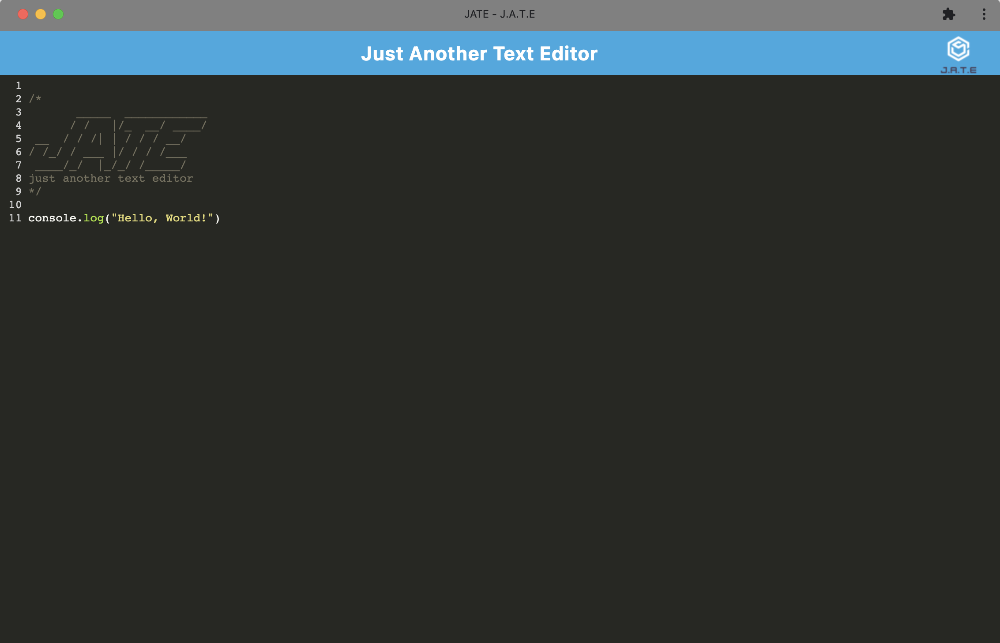

# PWA-Text-Editor

💻 [The repo can be found here.](https://github.com/WrittenInnaCode/PWA-Text-Editor)

📺 [Check out the deployed app here.](https://writteninnacode-text-editor.herokuapp.com/)
<br/><br/>

## Table of Contents:
* [Description](#description)
* [Installation](#installation)
* [Usage](#usage)
* [Screenshot](#screenshot)
* [Contributor](#contributor)
* [Questions](#questions)

<br/>

## Description
This is a text editor app that runs in the browser and functions offline. It is a single-page application that meets the PWA criteria. The app features a number of data persistence techniques that serve as redundancy in case one of the options is not supported by the browser.
<br/><br/>

## Installation
To install dependencies, run the following command for both the client and server sides:

```Terminal Commands
npm install
 ```
<br/>

After installing node modules, run this command to create the dist folder:
```
npm run build
```
<br/>

## Usage
 The application will be invoked by using the following command:
```
npm run start
```
The server will start and you can go to http://localhost:3000/ to run this application on your local machine. Click the `Install` button to download the application.
<br/><br/>

## Screenshot


<br/><br/>

## Contributor:
Inna Sherstnyova<br/>
Starter code was provided in my course materials.
<br/><br/>

## Questions:
If you have any questions, please contact me. 

📧 My email address is writteninnacode@gmail.com 

🌐 To find my GitHub page, visit [https://github.com/WrittenInnaCode](https://github.com/WrittenInnaCode)